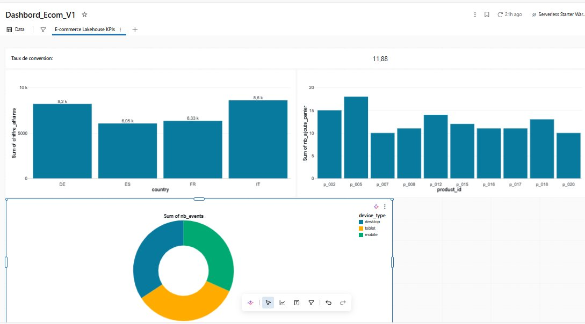

# Real-Time E-commerce Lakehouse

A production-style lakehouse pipeline built on **AWS S3 + Databricks + Unity Catalog**, simulating an e-commerce event stream and turning raw JSON events into business-ready KPIs.

> **Status:** V1 complete ✅ — batch ingestion with Auto Loader, medallion architecture (Bronze/Silver/Gold), and a live SQL dashboard. **V2 in progress 🚧** — real-time ingestion with Kinesis + Lambda implemented; CI/CD, governance and observability planned.

## 📑 Contents

| | Section | Status |
|---|---|---|
| 🟢 | [V1 — Batch Lakehouse](#-v1--batch-lakehouse) | ✅ Complete |
| 🔵 | [V2 — Real-time Ingestion](#-v2--real-time-ingestion-kinesis--lambda) | 🚧 In progress |
| 🔵 | [V2 — Planned Enhancements](#v2--planned-enhancements) | ⬜ Planned |

---

## 🟢 V1 — Batch Lakehouse

Everything below — architecture, data model, pipeline, dashboard — describes the **V1 batch
pipeline**: a Python script drops a file in S3, Databricks Auto Loader picks it up on demand.
This is the complete, working baseline. V2 (real-time ingestion) is documented further down
and builds on top of it without modifying it.

## Architecture

```
Python event generator → AWS S3 (raw) → Databricks Auto Loader
        → Bronze (Delta) → Silver (Delta) → Gold (Delta, KPI tables)
        → Databricks SQL Dashboard
```

| Layer | Purpose | Technology |
|---|---|---|
| **Source** | Simulated e-commerce events (`page_view`, `add_to_cart`, `order_created`) | Python |
| **Storage** | Raw event landing zone | AWS S3 |
| **Ingestion** | Schema-enforced, incremental file ingestion | Databricks Auto Loader |
| **Bronze** | Raw events, as-is | Delta Lake |
| **Silver** | Cleaned, deduplicated, typed | Delta Lake |
| **Gold** | Business KPIs | Delta Lake |
| **Serving** | Visual reporting | Databricks SQL Dashboard |
| **Infra** | Reproducible cloud resources | Terraform |
| **Security** | AWS ↔ Databricks auth | Unity Catalog + IAM Role (no static keys) |

---

## Why this project

This project was built to demonstrate practical, production-oriented Data Engineering skills beyond simple ETL scripting:

- Designing a **medallion architecture** (Bronze → Silver → Gold) with clear separation of concerns
- Using **Databricks Auto Loader** for schema-enforced, incremental ingestion from cloud storage
- Connecting AWS and Databricks the **secure way** — via Unity Catalog Storage Credentials and an IAM Role assumed through STS, with zero static credentials in code or cluster config
- Provisioning cloud infrastructure as code with **Terraform**
- Turning raw events into **business KPIs** that a real e-commerce team would track

---

## Data model

Each event follows a JSON schema with 3 event types:

```json
{
  "event_id": "uuid",
  "event_type": "page_view | add_to_cart | order_created",
  "event_ts": "ISO 8601 timestamp",
  "user_id": "string",
  "session_id": "string",
  "product_id": "string | null",
  "order_id": "string | null",
  "device_type": "mobile | desktop | tablet",
  "country": "FR | DE | ES | IT",
  "amount": "number | null",
  "currency": "EUR"
}
```

Full schema: [`src/event_generator/ecommerce_event.json`](src/event_generator/ecommerce_event.json)

---

## Project structure

**V1 (batch) — complete:**
```
real-time-ecommerce-lakehouse/
├── data/sample/events.json
├── src/
│   ├── event_generator/
│   │   ├── producer.py
│   │   └── ecommerce_event.json
│   └── databricks/
│       ├── bronze/01_bronze_ingestion.py
│       ├── silver/02_silver_transform.py
│       └── gold/03_gold_kpi.py
├── terraform/envs/dev/
│   ├── main.tf
│   ├── variables.tf
│   └── terraform.tfvars.example
└── README.md
```

**V2 (streaming) — additive, on top of the structure above:**
```
real-time-ecommerce-lakehouse/
├── src/
│   ├── event_generator/
│   │   └── producer_streaming.py            # NEW — streams to Kinesis
│   ├── lambda/
│   │   └── kinesis_to_s3/handler.py         # NEW — Kinesis consumer
│   └── databricks/
│       └── bronze/04_bronze_streaming_ingestion.py  # NEW
└── terraform/envs/dev/
    ├── streaming.tf                          # NEW — Kinesis + Lambda + IAM
    └── streaming_variables.tf                # NEW
```

---

## Pipeline details (V1)

### 1. Event generation

`producer.py` generates realistic e-commerce events with weighted probabilities matching a typical funnel:

- `page_view` — 70%
- `add_to_cart` — 20%
- `order_created` — 10%

```bash
python src/event_generator/producer.py
```

### 2. Infrastructure (Terraform)

Minimal AWS infrastructure: one S3 bucket for raw events and checkpoints.

```bash
cd terraform/envs/dev
terraform init
terraform apply
```

### 3. AWS ↔ Databricks connection

Databricks accesses S3 through a **Unity Catalog Storage Credential** backed by an IAM Role — no Access Keys stored anywhere.

- IAM Role `databricks-s3-role`, assumed by Databricks' Unity Catalog master role via `sts:AssumeRole`
- Scoped IAM policy granting S3 read/write + SQS/SNS (for Auto Loader file events) on the specific bucket only
- Unity Catalog **External Location** `rtl-dev-raw` pointing to the bucket

### 4. Bronze — raw ingestion

Auto Loader reads JSON files from S3 incrementally and writes to `formation.bronze.events`, enforcing the event schema.

### 5. Silver — cleaning

- Casts `event_ts` to a proper timestamp
- Deduplicates on `event_id`
- Filters invalid `event_type` values and null timestamps

### 6. Gold — business KPIs

Four KPI tables built from the Silver layer:

| Table | Description |
|---|---|
| `conversion_rate` | Per-user conversion: did the user place an order? |
| `ca_par_pays` | Revenue, order count, and average basket per country |
| `top_produits` | Top 10 products by cart additions |
| `distribution_device` | Event distribution across mobile / desktop / tablet |

### 7. Dashboard

A Databricks SQL Dashboard with 4 visualizations built on the Gold tables:

- Conversion rate (counter)
- Revenue by country (bar chart)
- Top products (bar chart)
- Device distribution (donut chart)



---

## Key results (V1, sample run, 1000 events)

| Metric | Value |
|---|---|
| Total users | 943 |
| Conversion rate | 11.88% |
| Top product | p_005 |
| Top country by revenue | IT (8.6k€) |

---

## Technical decisions

**Why Unity Catalog instead of cluster-level Spark config for S3 access?**
Storing Access Keys in cluster Spark config is a common anti-pattern — secrets end up in plaintext, visible to anyone with cluster access. Unity Catalog Storage Credentials use IAM Role assumption via STS, which is the AWS-recommended approach for cross-account access and leaves no static credentials anywhere.

**Why `trigger(availableNow=True)` instead of continuous streaming?**
For V1, batch-style incremental processing is sufficient and cost-effective. Continuous streaming is planned for V2 with Kinesis as the ingestion source.

**Why Delta Lake for every layer?**
ACID transactions, schema enforcement, and time travel are available out of the box, which matters even at small scale for data reliability.

---

## 🔵 V2 — Real-time ingestion (Kinesis + Lambda)

> Everything from here on is **V2** — additive on top of V1, nothing above this point was modified.

V2 replaces the manual file-drop pattern with an event-driven ingestion path, while keeping
the V1 batch pipeline untouched for comparison.

```
producer_streaming.py → Kinesis Data Stream → Lambda → S3 (streaming/)
        → Auto Loader → formation.bronze.events_streaming
```

### What was built

- **Kinesis Data Stream** (`rtl-dev-events-stream`) — receives one record per event, in real time
- **Lambda** (`rtl-dev-kinesis-to-s3`) — triggered automatically by Kinesis via an event source
  mapping (`batch_size=100`, `maximum_batching_window=5s`); decodes each batch and writes it as
  newline-delimited JSON to `s3://.../streaming/events/date=YYYY-MM-DD/`
- All infrastructure is provisioned in [`terraform/envs/dev/streaming.tf`](terraform/envs/dev/streaming.tf),
  with IAM permissions scoped to the Kinesis stream and the `streaming/` prefix only — same
  least-privilege principle used for the Databricks ↔ S3 connection
- A new notebook, [`04_bronze_streaming_ingestion`](src/databricks/bronze/04_bronze_streaming_ingestion.py),
  reads from this new prefix into a dedicated Bronze table, so V1 (batch) and V2 (streaming)
  results can be inspected side by side

### Ingestion latency: two honest layers

This pipeline has **two different latencies**, and it's worth being explicit about both:

| Hop | Latency | Real-time? |
|---|---|---|
| Producer → Kinesis → Lambda → S3 | ~5 seconds | ✅ Yes — events land in S3 within seconds of being generated |
| S3 → Auto Loader → Bronze | On-demand (`trigger(availableNow=True)`) | ❌ No — only runs when the notebook is manually executed |

The first hop is genuinely event-driven. The second hop, as configured, is still **batch-style
on-demand processing**: Auto Loader picks up whatever has accumulated in S3 since the last run,
then stops.

### Making the second hop real-time too

Auto Loader supports a continuous trigger that keeps the stream running indefinitely, polling
for new files every few seconds instead of running once and stopping:

```python
query = (
    df_bronze_streaming
    .writeStream
    .format("delta")
    .outputMode("append")
    .option("checkpointLocation", checkpoint_path)
    .option("mergeSchema", "true")
    .trigger(processingTime="10 seconds")   # <- continuous, instead of availableNow=True
    .toTable("formation.bronze.events_streaming")
)
```

This was tested directly: with this trigger active, the cluster keeps the stream alive and
ingests new files within ~10 seconds of Lambda writing them — genuinely real-time, end to end.

**Why it isn't run this way by default in this project:** a continuous trigger requires the
Databricks cluster to stay **running permanently**, since the streaming query never terminates.
On a dev/demo project, that means paying for compute 24/7 to process a trickle of simulated
events — a cost that isn't justified outside of latency-critical use cases (e.g. fraud detection).

**What this would look like with `processingTime="10 seconds"` running continuously**, simulated
from the actual test:

```
22:58:48  Lambda writes batch (23 events) → s3://.../date=2026-06-19/9afc...json
22:58:58  Auto Loader picks it up (within 10s) → formation.bronze.events_streaming (+23 rows)
22:59:02  Lambda writes batch (25 events) → s3://.../date=2026-06-19/f4f4...json
22:59:12  Auto Loader picks it up (within 10s) → formation.bronze.events_streaming (+25 rows)
...
```

**What's used instead, and why it's a reasonable trade-off for this project:** `trigger(availableNow=True)`,
run on demand (or schedulable via a Databricks Job every 1-2 minutes for a "near real-time"
middle ground without 24/7 compute cost). This keeps the demonstrated architecture fully
production-realistic — the continuous-trigger code above is the only line that would change to
flip it to true real-time — without paying for an idle cluster.

---

## V2 — Planned enhancements

- ~~Kinesis + Lambda — real-time event-driven ingestion~~ ✅ Done (see above)
- **CI/CD** — GitHub Actions + Databricks Asset Bundles for automated deployment
- **Advanced governance** — Unity Catalog ACLs, data lineage
- **Delta Live Tables** — declarative pipelines with data quality expectations
- **Observability** — pipeline monitoring, freshness SLAs, alerting
- **Scheduled near-real-time** — Databricks Job running the streaming Bronze notebook every
  1-2 minutes, as a cost-conscious middle ground between on-demand batch and 24/7 streaming

---

## Tech stack

`AWS S3` · `AWS IAM` · `AWS Kinesis` · `AWS Lambda` · `Databricks` · `Unity Catalog` · `Delta Lake` · `Auto Loader` · `PySpark` · `Databricks SQL` · `Terraform` · `Python`

---

## Author

Built as part of a Data Engineer reconversion project, alongside Databricks certification preparation.
